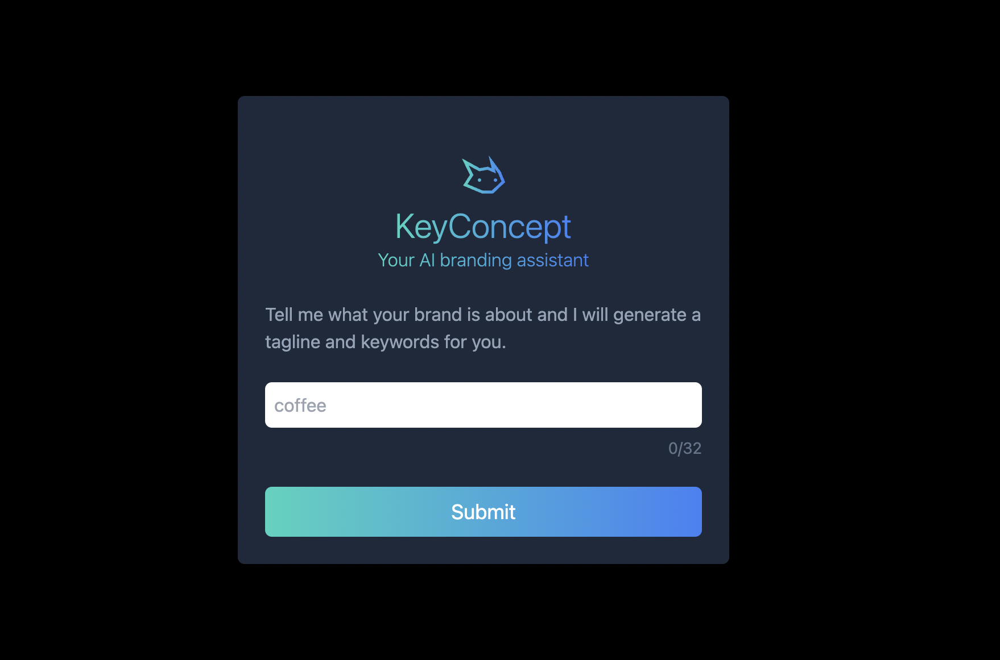

<h2> Key-Concept AI Driven Branding Assistant </h2>
<h4> Python, OpenAI, AWS Lambda, Docker, AWS CDK, React.js, Next.js, Tailwind CSS </h4>

 I've created a full-stack responsive web application that acts as a branding assistant. The application asks about your brand and then provides you with a tag line and keywords to help build your brand identity.

I leveraged the power of OpenAI for generating the tag line and keywords. For the back-end, I used Python and FastAPI to create a web API and connect it with OpenAI. I then hosted the back-end on AWS using a Lambda function and Docker to manage the dependencies. To make the API accessible, I used AWS API Gateway to get an API endpoint. Finally, I packaged everything up into a single, manageable unit using AWS CDK. A fully functional serverless API: https://k0237ecbrc.execute-api.us-east-2.amazonaws.com/prod/For the front-end, I built the application using React and Next.js with TypeScript. I designed the user interface using Tailwind CSS. Deployed the application on vercel.com.

